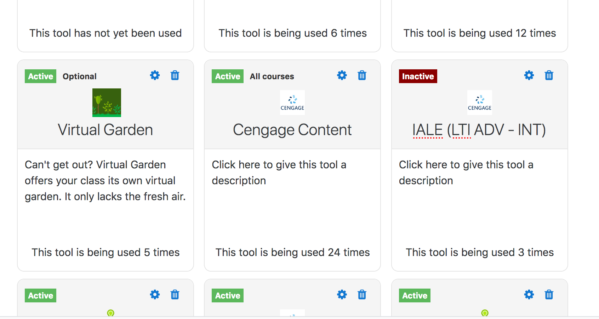

# Optional Course Deployment

A key issue with current moodle is that any LTI tool added at the site level
becomes automatically added in each and every course. This makes the option
to show in Activity Chooser quickly a no go. And might force some institutions
to mandate each instructor to deploy the LTI tool directly in the course and
not use the Site deployment.

As new placements for LTI are made available (for example as left-panel course
level links), it becomes more and more important to make the addition of
site level LTI tools to tool an optional option. Instructors can then pick
from the list of configured site tools the one they care to use.

## Deployment option

As part of a site tool configuration, a provisioning option is proposed with the
following choices:

- **All courses**: the tool will appear in all courses, and cannot be removed
- **Optional**: the instructor has to add the tool to her course before to use it
- **Not available**: the tool cannot currently be added to a course

## Provision entity

Part of the configuration of a course is now the option to manage external tools.

Some questions need to be clarified:

- what happens when a tool with links is removed from a course?
- what happens when a 'All courses' tool is changed to optional?
- what happens when a course is backed up? i.e. how is the tool identified (base URL seems the only option)

