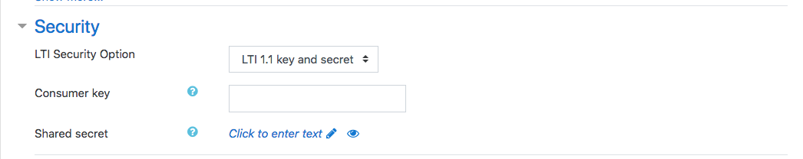
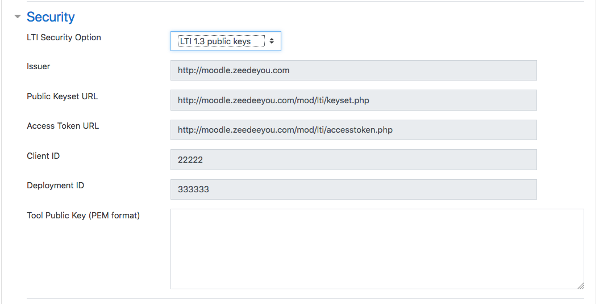
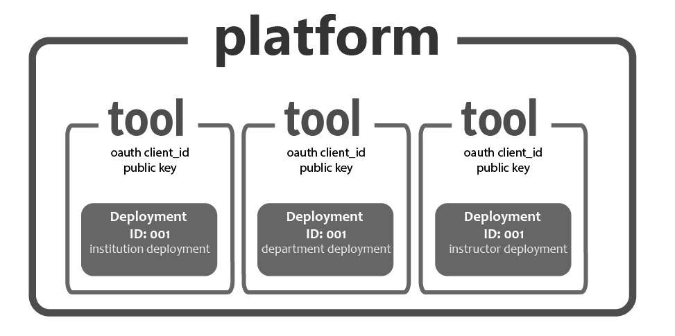
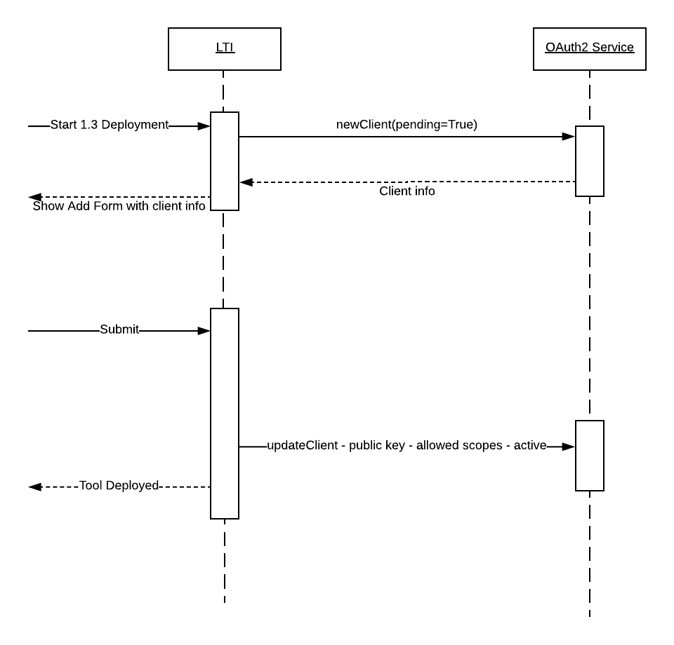

# Step 1: bringing LTI 1.3 support in moodle

## Overview

In that initial step, LTI 1.3 support is added to moodle. It exposes the LTI 1.3 settings
to the user and is a manual process. From this foundation, additional flows - moodle specific -
will be added to simplify the deployment or migration to an LTI 1.3 deployment.

The main decisions for this plan are:

- in place update: lti 1.3 support is added to mod_lti, it is not a new lti module
- tools can decide the security model as part of the tool configuration, making a migration easy
- API access token is externalized to a new service, so that it may eventually be used/extended to protect non-LTI services in a unified fashion

# Deployment of an LTI 1.3 tool

## New security settings

As part of the external tool configuration, a new service section is added to allow the user
to select the securiy model governing the deployment. This can later be changed when editing
the tool allowing a migration from a 1.1 model to 1.3 one.

The code displaying this option is under: https://github.com/CengageEng/moodle/commit/e18b249ddaff7e41b114e58273e2feed7cd46c1b

## What's in an LTI 1.3 deployment?

LTI 1.3 deployments are more complex because they are assymetric: the communication
from moodle to the tool uses a different set of credentials than the one used for
communication from the tool back to moodle. In addition, the use of public/secret key
improves the overall security by not having to exchange secrets between the 2 parties,
but now public key must be exchanged which is arguably a bit less easier than exchanging
a secret.

A key benefit of LTI 1.3 is the use of OAuth 2.0 client credentials grant; services
are now protected using scoped access tokens, no need for OAuth body hashing! However
a tool must now know how to request the access token, which is extra deployment information
that needs to be configured on the tool side.

In short, with LTI 1.1, a deployment was mostly a one way operation: the tool gave you a
key and secret, a url. You deployed using it. With LTI 1.3 the tool to also configure itslelf
with the public key information from moodle install, the token end point request and an
actual identifier of that moodle instance. Deployment now happens on both side...

The LTI 1.3 properties of a tool are (as illustrated in screenshot above):

- **moodle instance id**: the platform identifier (url), used by the tool to identify the 
issuer of the incoming request. Moodle defines it.
- **public key set url**: url for the set of public keys. Will be used by the tool to assert
incoming JWT are signed by the platform (iss). Moodle defines it.
- **client_id**: OAuth 2.0 client id, to which the client public key is attached. Used by
the platform to identify the caller. Moodle generates it.
- **client public key (PEM)**: in this first iteration, the tool will provide its RSA public
key in the PEM format. This is the only piece of data provided by the tool.
- **access token url**: Url to request an access token. Moodle defines it.
- **deployment id**: a unique identifier of that deployment. For now there will be a one to
one between deployment and client id. In the future, it might be used to differentiate
deployments of the same tool (same client id with multiple deployments)

## Registering a new client with OAuth2 Client Service

While the OAuth2 related code (client id, token access point) could be implemented
directly within mod_lti code base, it would prevent to extend the solution to be
generalized to any service.

From an LTI standpoint, the OAuth 2.0 service is needed for:

- register a new client; ideally a client can be deployed in pending mode
so that OAuth information can be displayed in the tool admin as shown in
admin screenshot above. Client will have a set of scopes it is allowed to request.
- expose a token endpoint
- validate a token against a scope (to verify the access token has the right to
execute the incoming request)
- return current client info and allow for the scopes and public key to be modified
by mod_lti code

## Custom OAuth code or library?

Since LTI 1.3 limits itself to client grant, the OAuth 2.0 are small enough to be
built from scratch.

However if moodle intends to offer OAuth flows, an investigation should be made to
assess if an existing OAuth 2.0 library can be re-used.

TBD list here existing options for PHP to investigate...

## Storing deployment info

TBD: extend lti_type? Needs to store the client_id and deployment_id.

## Public Keyset and Issuer identifier

The public key set is only used to for LTI Messages to verify the JWT signature.
As such, it might be ok to implement the platform keyset feature within
mod_lti, unless its usage want to be generalized, in which case a centralized
service would be more suitable.

### Storing the private keys

Private keys are sensitive data, so some thoughts must be put in how they will be
stored. One approach could be to use the PEM format with a passphrase directly
in a new dedicated table.

The passphrase might be a local config option. More investigation here...

For example:

**mod_lti_keys**

- kid: key id
- alg: RSA
- private_key: pem encoded with passphrase
- public_key_n
- public_key_e
- created_date

### Serving the public keys and key rotation

A URL exposes the public keys with JWKS format. This should be good candidate for
caching as keys are immutables (identified by kid).

An automatic key rotation can be added; when adding a new key, the old key should
remain in the set for a small amount of time to insure a seamless rotation.

# Changes to Launches

## Launch mechanic

The launch mechanics must be modified to generate a signed JWT in place of the OAuth 1.0a
signed form.

1. Build JWT: same data as data, but now in a JSON structure
1. Ask Platform Keys subsystem to sign it
1. Post redirect to tool URL under the `open_id`

## Services updated to inject service claims

Under 1.1 a service can inject custom parameters (like custom_lineitems_url). In LTI 1.3,
data in now passed as claims (i.e. properties directly added to the JWT root).

Service callbacks need to be updated to support claim injection in JWT payload.

## Deep Linking changes

DeepLinking 2.0 replaces Content Item Selection request for LTI 1.3. It is similar in
concept but defines a cleaner type model.

A new return handler will be passed that will expect the JWT response from the tool.
While the JWT will be signed by the tool private key, it is not needed for the
moodle handler to verify the signature as the transaction is protected under the
user's session, and the deep linking data is only used to pre-fill the form.

# Changes to services

Services must expect the presence of a bearer token in the request, and delegate to the
OAuth 2.0 service, something like: `is_authorized(token, scope)`.

