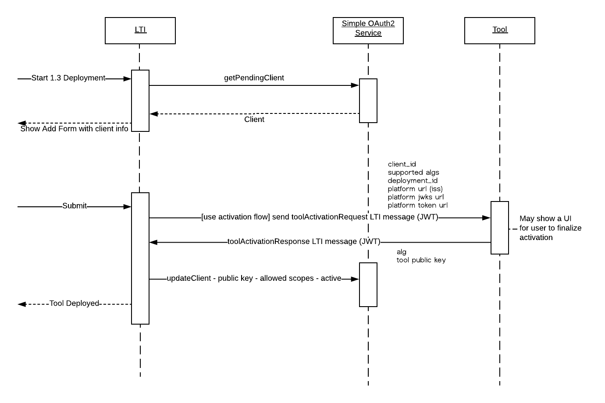

# Activation flow


The activation flow significantly simplifies the deployment of an LTI 1.3 tool
by:

- automatically sharing the clientId, deploymentId, keysets and token url as well
as the tool public key
- allowing the app to optionaly show an activation flow of its own

## Activation message

The activation message is an LTI message signed by the platform and containing
relevant information about the context of the deployment. The tool on receiving
the message may show its own activation flow, or automatically respond.

The tool response specifies if the tool has been activated, and return the public
key to use with the tool.



### Activation Request

#### Success

A [moodleToolActivationRequest](examples/toolActivationRequest.json) passes the key
information of the deployment, including the JWKS and token endpoints. To mitigate
the risk of phising, the endpoints must be relative to the platform URL (iss).

The message is signed by one of the platform private key. The tool can get the
public by fetching the keyset at `https://moodle.org/lti/platform.jwks_uri`.

Simplified JWT for app activation:

```json
{
  "iss": "https://moodle.myuniv.edu",
  "aud": ["962fa4d8-bcbf-49a0-94b2-2de05ad274af"],
  "https://purl.imsglobal.org/spec/lti/claim/deployment_id":
    "07940580-b309-415e-a37c-914d387c1150",
  "https://purl.imsglobal.org/spec/lti/claim/message_type": "moodleToolActivationRequest",
  "https://purl.imsglobal.org/spec/lti/claim/tool_platform": {
    "url": "https://moodle.myuniv.edu/lti/activation/confirm?354w798d",
  },
  "https://moodle.org/lti/platform": {
      "alg": ["RS256"],
      "token_url": "/mod/lti/token.php",
      "jwks_uri": "/mod/lti/public_keyset.php"
  }
}
```

The return url is an important piece; it should be unique use URL and have a limited
TTL (1 hour).

### Activation Response

The [activation response](examples/toolActivationResponse.json) confirms the app
is now active, and the public key to use to identify it. It closes the
app deploy and activation flow. The app can now be used in moodle.

```json
{
    "iss": "962fa4d8-bcbf-49a0-94b2-2de05ad274af",
    "aud": "https://moodle.myuniv.edu",
    "https://purl.imsglobal.org/spec/lti/claim/deployment_id": "07940580-b309-415e-a37c-914d387c1150",
    "https://purl.imsglobal.org/spec/lti/claim/message_type": "moodleToolActivationResponse",
    "https://moodle.org/tool/status": "active",
    "https://moodle.org/tool/jwks": {
        "keys": [
            {
                "alg": "RS256",
                "kty": "RSA",
                "use": "sig",
                "n": "yeNlzlub94YgerT030codqEztjfU_S6X4DbDA_iVKkjAWtYfPHDzz_sPCT1Axz6isZdf3lHpq_gYX4Sz-cbe4rjmigxUxr-FgKHQy3HeCdK6hNq9ASQvMK9LBOpXDNn7mei6RZWom4wo3CMvvsY1w8tjtfLb-yQwJPltHxShZq5-ihC9irpLI9xEBTgG12q5lGIFPhTl_7inA1PFK97LuSLnTJzW0bj096v_TMDg7pOWm_zHtF53qbVsI0e3v5nmdKXdFf9BjIARRfVrbxVxiZHjU6zL6jY5QJdh1QCmENoejj_ytspMmGW7yMRxzUqgxcAqOBpVm0b-_mW3HoBdjQ",
                "e": "AQAB",
                "kid": "NjVBRjY5MDlCMUIwNzU4RTA2QzZFMDQ4QzQ2MDAyQjVDNjk1RTM2Qg"
            }
        ]
    }
}
```

#### Failure to activate

The app may actually fail the activation, and the 
[failed moodleToolActivationResponse](examples/toolActivationResponseFailed.json)
may contain an error message to present to the end user;
in that case, the app remains PENDING and cannot be used. A new activation
attempt can be tried (with a new return URL).

## Deployment instruction example

With an activation flow, the deployment of a new app, in particular if it can use
its main URL for all the interactions, can become much easier.

> To deploy Virtual Garden in moodle, go to External tool, and select + to add
a new tool. In the url, enter: https://virtualgarden.example.com/lti. Make sure
you check content item message and set the security option to be LTI 1.3 automatic.
In the services section select Use this service
for grade sync only for the IMS LTI Assignment and Grade Services.

Note that this is still a mouthful and will get more complicated as the number of
options increase. Thus the proposal of a tool descriptor that can be used to
pre-fill all those options proposed in the [next step](step3-almostAutomaticWithDeepLinking.md).
